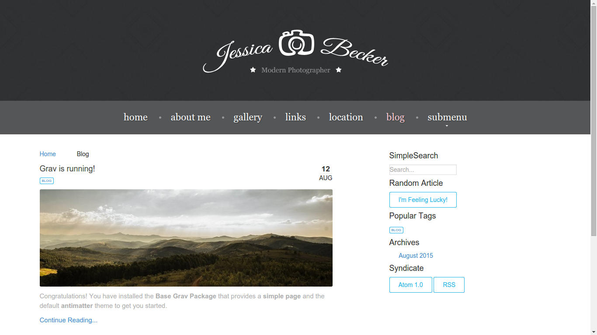

# Grav Blog Plugin

`Blog` is a [Grav](http://github.com/getgrav/grav) plugin that makes available the functionalities to add a blog to each Grav theme. Blog can be used with `Pure Grids` or `Bootstrap` framework.

The full ducumentation is available at the [developer's website](http://diblas.net/plugins/blog-grav-cms-plugin-adds-blog-functionalities-to-each-grav-theme)